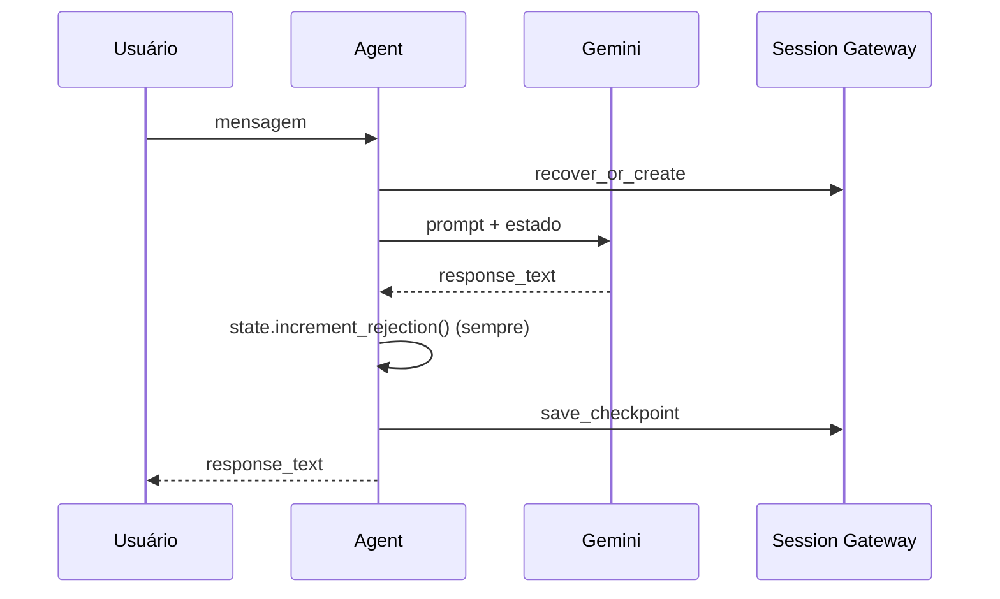
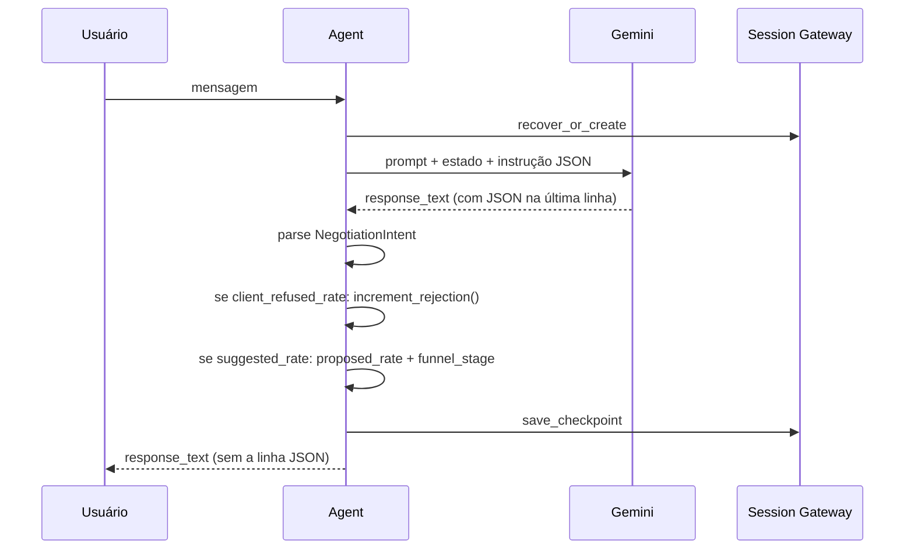

# Lab guiado 01: Detecção de recusa pelo LLM e atualização condicional do estado

Este lab guiado implementa um **recurso avançado** no Agente 3 - The Memory: em vez de incrementar o contador de recusas em toda mensagem, o agente passa a usar uma **resposta estruturada** do LLM para decidir quando o cliente de fato recusou a taxa e quando o agente propôs uma taxa. Assim você aprende **structured output** (via JSON no prompt), **FSM condicional** e integração com o fluxo existente (checkpoint, circuit breaker).

---

## 1. Objetivo e contexto

### Por que não incrementar em toda mensagem?

Hoje, em [src/agent_router.py](src/agent_router.py), após cada resposta do LLM o código chama `state.increment_rejection()` **sempre**. Isso funciona na demo (onde as mensagens simuladas são sempre de recusa), mas em produção:

- Mensagens como "Sim, fecho com essa taxa" ou "Preciso de mais detalhes" seriam contadas como recusa.
- O circuit breaker (handoff após N recusas) seria acionado mesmo sem o cliente ter recusado de fato.

O ideal é **incrementar apenas quando o conteúdo da conversa indicar que o cliente recusou a taxa**.

### O que vamos construir

1. **Schema de resposta estruturada**: o LLM devolve, além do texto para o usuário, um bloco com:
   - `client_refused_rate`: se o cliente recusou a taxa nesta mensagem (`true`/`false`).
   - `suggested_rate`: taxa que o agente propôs na resposta, se houver (`number` ou `null`).

2. **Atualização condicional do estado** no orquestrador:
   - Chamar `state.increment_rejection()` **somente** quando `client_refused_rate` for `true`.
   - Quando `suggested_rate` for informado e válido, atualizar `state.proposed_rate` e `state.funnel_stage = "rate_proposed"`.

3. **Prompt e parsing**: instruir o LLM a colocar um JSON na última linha da resposta e fazer o parse no Python (abordagem estável com o Google ADK atual).

---

## 2. Pré-requisitos

- Ambiente configurado: `.env` com `GOOGLE_API_KEY` ou variáveis Vertex (veja [README.md](../README.md)).
- Ter lido a seção do orquestrador e do fluxo em [AULA.md](AULA.md) (seções 5 e 6).
- Opcional: ter completado o [LAB-DESAFIO.md](../LAB-DESAFIO.md) para entender o fluxo de checkpoint.

---

## 3. Visão do fluxo: antes e depois

**Fluxo atual (antes):**



**Fluxo novo (depois):**



---

## 4. Passo 1 – Definir o schema da resposta

Crie um novo módulo para o schema da resposta estruturada do LLM.

**Arquivo:** `src/response_schemas.py`

```python
"""Schema Pydantic para a resposta estruturada do LLM (detecção de recusa e taxa proposta)."""

from pydantic import BaseModel, Field


class NegotiationIntent(BaseModel):
    """
    Intenção extraída da resposta do negociador.
    Preenchido pelo LLM via última linha JSON (ver prompts e agent_router).
    """
    client_refused_rate: bool = Field(
        default=False,
        description="True se o cliente recusou a taxa nesta mensagem.",
    )
    suggested_rate: float | None = Field(
        default=None,
        description="Taxa de juros que o agente propôs na resposta (ex.: 1.25), ou None.",
    )
```

- `client_refused_rate`: o LLM deve setar `true` apenas quando interpretar que o cliente está recusando a taxa.
- `suggested_rate`: quando o agente mencionar uma taxa numérica na resposta (ex.: "Proponho 1,25% a.m."), esse valor deve vir aqui para persistirmos no estado.

Salve o arquivo. Esse modelo será usado no Passo 3 para parsear o JSON.

---

## 5. Passo 2 – Formato da resposta estruturada (última linha JSON)

Como o Google ADK Runner devolve o texto da resposta em fluxo (eventos), usamos a **Opção B** do plano: instruir o LLM a colocar um JSON na **última linha** da resposta. O orquestrador então:

1. Separa a última linha do restante do texto.
2. Tenta parsear a última linha como JSON e validar com `NegotiationIntent`.
3. Retorna ao usuário apenas o texto **sem** a última linha (para não exibir o JSON na conversa).

Formato esperado da última linha:

```json
{"client_refused_rate": true, "suggested_rate": 1.25}
```

Ou quando não há recusa nem taxa: `{"client_refused_rate": false, "suggested_rate": null}`.

No próximo passo você vai implementar a função de parse e a lógica condicional no orquestrador; no Passo 4 vamos ajustar o prompt para o LLM gerar esse JSON.

---

## 6. Passo 3 – Integrar no orquestrador

Abra [src/agent_router.py](src/agent_router.py). Serão necessárias três alterações: import do schema e da função de parse, uma função auxiliar para extrair e parsear o intent, e a lógica condicional em `process_message`.

### 6.1 Imports

No topo do arquivo, adicione:

```python
import json
```

E o import do schema:

```python
from src.response_schemas import NegotiationIntent
```

### 6.2 Função auxiliar: extrair texto e intent

Adicione após os imports (por exemplo, após `_load_max_rejections`):

```python
def _parse_response_and_intent(response_text: str) -> tuple[str, NegotiationIntent]:
    """
    Separa o texto exibível do usuário da última linha (JSON do intent).
    Retorna (texto_para_usuario, intent). Em falha de parse, intent seguro (sem recusa).
    """
    intent = NegotiationIntent(client_refused_rate=False, suggested_rate=None)
    if not response_text or not response_text.strip():
        return response_text, intent

    lines = response_text.strip().split("\n")
    if not lines:
        return response_text, intent

    last_line = lines[-1].strip()
    try:
        data = json.loads(last_line)
        intent = NegotiationIntent(**data)
        text_for_user = "\n".join(lines[:-1]).strip() if len(lines) > 1 else ""
        return text_for_user or response_text, intent
    except (json.JSONDecodeError, TypeError, ValueError):
        return response_text, intent
```

- Se a última linha for um JSON válido e bater com `NegotiationIntent`, usamos esse intent e devolvemos o resto como texto ao usuário.
- Se der erro de parse, devolvemos o texto original e um intent seguro (`client_refused_rate=False`), para não incrementar recusa por engano.

### 6.3 Alterar `process_message`: usar intent e atualizar estado condicionalmente

Localize o trecho que hoje está assim:

```python
        response_text = ""
        async for event in self.runner.run_async(
            ...
        ):
            ...

        state.increment_rejection(max_rejections=self._max_rejections)
        if state.funnel_stage == "human_handoff":
            pass
        await self.session_gw.save_checkpoint(adk_session, state)

        return response_text
```

Substitua pela lógica abaixo:

1. **Parse da resposta:** após o `async for`, separe texto e intent:

```python
        response_text = ""
        async for event in self.runner.run_async(
            user_id=USER_ID,
            session_id=session_id,
            new_message=new_message,
        ):
            if event.content and event.content.parts:
                for part in event.content.parts:
                    if getattr(part, "text", None):
                        response_text = part.text

        text_for_user, intent = _parse_response_and_intent(response_text)
```

2. **Atualização condicional do estado:** em vez de sempre chamar `increment_rejection()`, use o intent e opcionalmente atualize `proposed_rate` e `funnel_stage`:

```python
        if intent.client_refused_rate:
            state.increment_rejection(max_rejections=self._max_rejections)
        if intent.suggested_rate is not None and intent.suggested_rate > 0:
            state.proposed_rate = intent.suggested_rate
            state.funnel_stage = "rate_proposed"

        await self.session_gw.save_checkpoint(adk_session, state)

        return text_for_user
```

Remova o `if state.funnel_stage == "human_handoff": pass` se ficar redundante; o circuit breaker já é tratado no início do método (retorno antecipado quando `funnel_stage == "human_handoff"`).

Resumo do que mudou:

- Só incrementamos recusa quando `intent.client_refused_rate` for `True`.
- Quando o LLM informar `suggested_rate`, persistimos em `state.proposed_rate` e avançamos o funil para `rate_proposed`.
- O usuário recebe `text_for_user` (resposta sem a linha do JSON).

---

## 7. Passo 4 – Ajustar o prompt

O LLM precisa ser instruído a sempre terminar a resposta com uma única linha em JSON.

Abra [prompts/negotiator.jinja2](prompts/negotiator.jinja2) e adicione ao final das diretrizes (por exemplo, após o item 4):

```jinja2
5. Ao final de CADA resposta, escreva exatamente uma linha em JSON, sem outro texto na mesma linha, com os campos:
   - "client_refused_rate": true apenas se o cliente recusou ou demonstrou insatisfação com a taxa nesta mensagem; caso contrário false.
   - "suggested_rate": um número (ex.: 1.25) se você propôs uma taxa de juros na resposta; caso contrário null.
   Exemplo de última linha: {"client_refused_rate": false, "suggested_rate": 1.25}
```

Assim o modelo passa a emitir o JSON na última linha; o `_parse_response_and_intent` no orquestrador separa essa linha do texto e atualiza o estado conforme o Passo 3.

---

## 8. Passo 5 – Testar e validar

### 8.1 Executar a demo

No diretório raiz do projeto:

```bash
python -m src.main
```

Comportamento esperado:

- O [main.py](../src/main.py) envia três mensagens simuladas de recusa. Com o novo fluxo, o LLM deve marcar `client_refused_rate: true` nessas mensagens, então o contador deve subir e na terceira recusa o handoff deve ser acionado (mensagem de transferência para especialista).
- A resposta exibida ao usuário não deve conter a linha crua do JSON (ela é removida por `_parse_response_and_intent`).

### 8.2 Teste manual sugerido

Para validar a detecção condicional, você pode temporariamente alterar as mensagens em `main.py`:

- Uma mensagem como: "Sim, fecho com essa taxa de 1,2%."  
  Esperado: o LLM deve responder com algo como `"client_refused_rate": false` e, se mencionar taxa, `"suggested_rate": 1.2`. O `rejection_count` não deve aumentar.
- Uma mensagem como: "Não aceito, está muito alto."  
  Esperado: `"client_refused_rate": true` e o contador deve incrementar.

### 8.3 Critérios de sucesso

- Resposta ao usuário sem a linha JSON visível.
- Contador de recusas sobe apenas quando o LLM indica recusa.
- Quando o LLM informa uma taxa, `state.proposed_rate` e `state.funnel_stage == "rate_proposed"` são persistidos no checkpoint.
- Após N recusas (configurado em `config/memory_policy.yaml`, ex.: 3), o fluxo retorna a mensagem de handoff sem chamar o LLM de novo.

---

## 9. Resumo e extensões

### O que você implementou

- **Schema de resposta:** `NegotiationIntent` em `src/response_schemas.py` para `client_refused_rate` e `suggested_rate`.
- **Resposta estruturada:** última linha da resposta do LLM em JSON; parse com fallback seguro em `_parse_response_and_intent`.
- **FSM condicional:** `increment_rejection()` só quando `client_refused_rate` é `true`; atualização de `proposed_rate` e `funnel_stage` quando `suggested_rate` é informado.
- **Prompt:** instrução no `negotiator.jinja2` para o LLM sempre terminar com o JSON na última linha.

### Extensões sugeridas

- **Mais campos no intent:** por exemplo `documents_requested: bool` e usar no funil para um estágio "waiting_documents".
- **Retry em conflito OCC:** em [src/agent_router.py](src/agent_router.py), ao capturar `ConcurrentWriteError` em `save_checkpoint`, chamar `recover_or_create` de novo, reaplicar a mesma lógica de atualização de estado (intent) e tentar `save_checkpoint` novamente (até um limite de tentativas). Ver conceito em [AULA.md](AULA.md) (OCC e Defense in Depth).

---

**Documentação relacionada:** [AULA.md](AULA.md) (arquitetura e orquestrador) · [LAB-DESAFIO.md](../LAB-DESAFIO.md) (checkpoint e circuit breaker)
